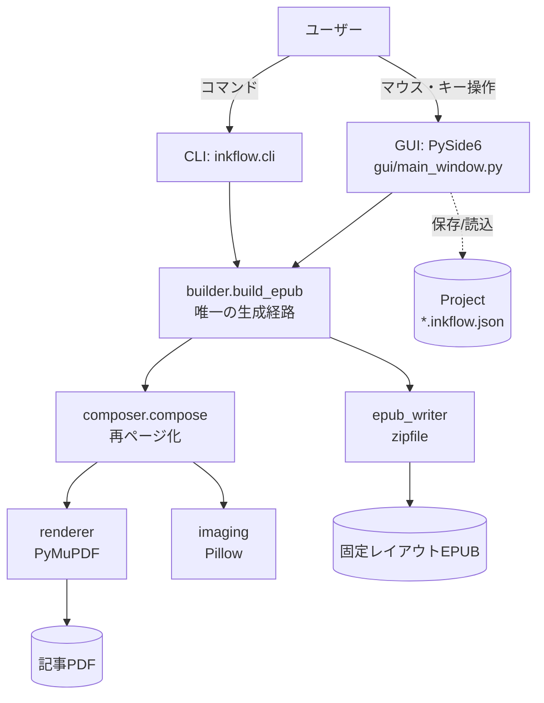
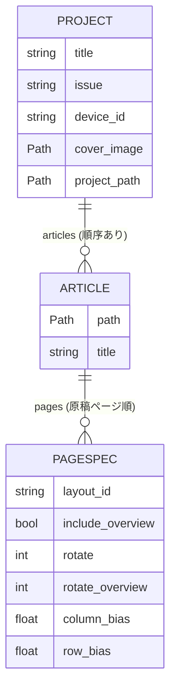
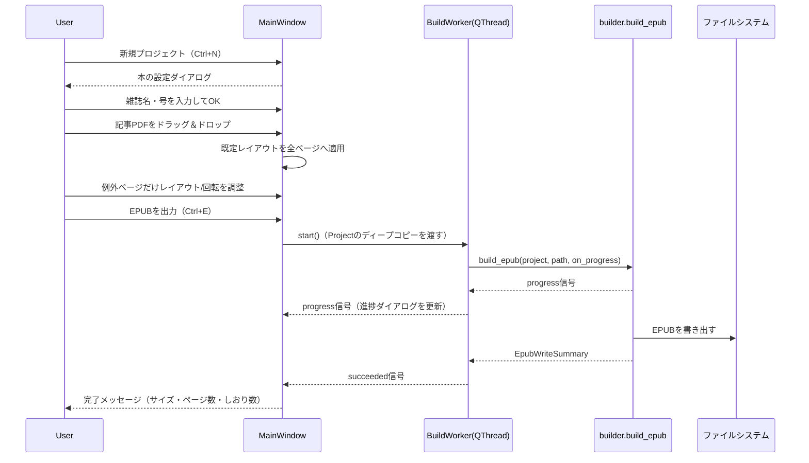
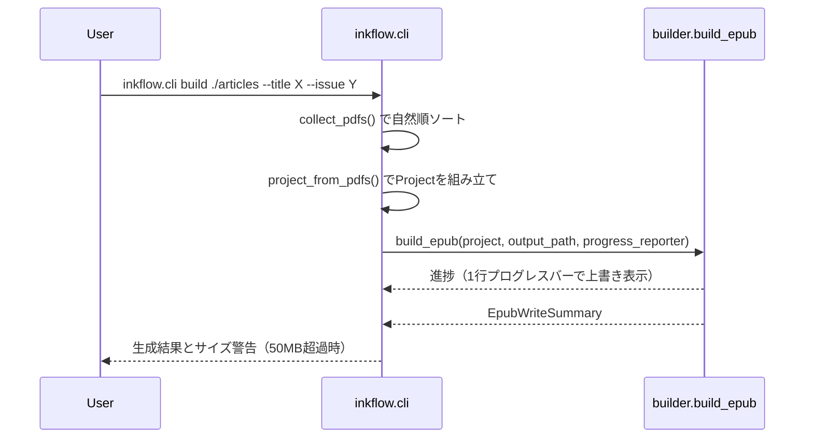
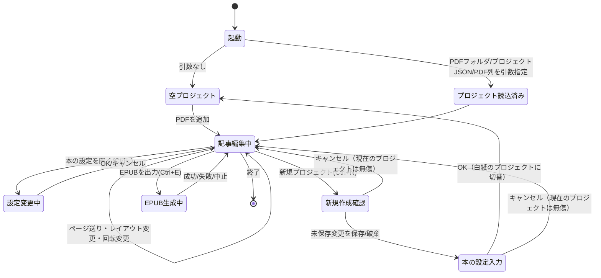

# 機能設計書 (Functional Design Document)

`docs/architecture.md` がレイヤ構成と依存関係（「どう組み立てるか」）を扱うのに対し、本書は画面遷移・データ構造・アルゴリズム・エラー分類など「何が起きるか」を扱う。両者は補完関係にあり、内容が重複する箇所は `docs/architecture.md` を正とする。

## システム構成図



GUIとCLIは**必ず `builder.build_epub()` を共通の入口として通る**。これによりGUIから出したEPUBとCLIから出したEPUBが常に一致する（`tests/test_cli.py::test_cli_and_gui_paths_produce_identical_pages` で固定）。

## 技術スタック

| 分類 | 技術 | 選定理由 |
|------|------|----------|
| 言語 | Python 3.12 | Windowsデスクトップで完結、PyMuPDF/Pillow/PySide6の成熟したエコシステム |
| GUI | PySide6（Qt6） | ネイティブWindowsアプリとして配布でき、`QPainter` で分割枠のオーバーレイ描画が可能 |
| PDFレンダリング | PyMuPDF (pymupdf) | 高速・グレースケール直接出力に対応しメモリ効率が良い |
| 画像処理 | Pillow | トリム・リサイズ・階調変換・アイコン/表紙生成まで一貫して扱える |
| EPUB生成 | 標準 `zipfile` | 固定レイアウトEPUBの構造は単純なため、外部ライブラリ（ebooklib等）を導入せずKindle固有メタデータを完全制御する |
| テスト | pytest | GUIは `QT_QPA_PLATFORM=offscreen` でヘッドレス実行 |
| 配布 | PyInstaller | Python未導入のWindows環境でも単独実行可能な形にする |

## データモデル定義

`inkflow/models.py` で定義される。DBは使わず、プロジェクト全体を1つのJSONファイル（`*.inkflow.json`）に永続化する。

### エンティティ: Project（1号分の作業単位）

```python
@dataclass
class Project:
    title: str                     # 雑誌名
    issue: str                     # 号（例: "2026年8月号"）
    device_id: str                 # 出力先端末プリセットID
    defaults: PageDefaults         # 新規ページの既定値
    image: ImageOptions            # 画像品質設定
    articles: list[Article]        # 記事（並び順 = 本の順序）
    cover_image: Path | None       # 表紙画像（未指定なら自動生成）
    project_path: Path | None      # 保存先。None なら未保存
```

### エンティティ: Article（記事 = PDF 1本 = しおり1項目）

```python
@dataclass
class Article:
    path: Path              # 記事PDFへのパス（プロジェクトファイルから相対保存）
    title: str               # しおり名（既定はファイル名）
    pages: list[PageSpec]    # 原稿ページごとの分割設定
```

### エンティティ: PageSpec（原稿1ページぶんの設定）

```python
@dataclass
class PageSpec:
    layout_id: str                  # 分割レイアウトID（既定 "quad_2col"）
    include_overview: bool          # ページ全体（俯瞰）を出力するか
    rotate: int                     # 分割コマの縦横入替（0/90/270、時計回り）
    rotate_overview: int | None     # 俯瞰の縦横入替。None = 分割コマと同じ
    column_bias: float | None       # 左右の分割線のオフセット。既定0.0（既定位置固定）。None=自動検出
    row_bias: float | None          # 上下の分割線のオフセット。既定0.0（既定位置固定）。None=自動検出
```

**制約**:
- `rotate` / `rotate_overview` は `{0, 90, 270}` のみ許容。範囲外の値は既定（`rotate_overview` は `None`）へ正規化される（例外にしない）。
- `column_bias` / `row_bias` は `-0.2`〜`0.2` にクランプされる（`MAX_DIVIDER_BIAS`）。**既定値は `0.0`**（オフセット無し＝既定位置に固定。自動検出は既定では無効）。`None` は「自動検出に任せる」を意味し、GUIで `[自動]` を明示的に押したときだけ入る値（`rotate_overview` の `None`=「分割コマと同じ」とは異なり、`None` は既定値ではなく明示的なオプトイン状態である点に注意）。数値を指定した軸は自動検出を行わず、その値をそのまま使う（自動検出結果への加算ではない）。
- `layout_id` が未知のIDなら既定レイアウトへフォールバックする。
- 未知のJSONキーは無視し、欠けたキーは既定値で補う（前方・後方互換）。

### 構造図



## コンポーネント設計

各モジュールの責務は `docs/architecture.md` §1〜2 に詳しい。ここでは機能設計上の要点のみ再掲する。

### composer（再ページ化の中核）

**責務**:
- `Project` を走査し、原稿ページ1枚を複数の出力ページ（俯瞰＋分割コマ）に展開する
- 俯瞰と分割コマそれぞれの必要解像度を求め、両方を満たす解像度で**1回だけ**レンダリングする

**インターフェース**:
```python
def compose(project: Project, on_progress: Callable[[int, int], None] | None = None) -> Iterator[ComposedPage]
def total_output_pages(project: Project) -> int
def sync_page_counts(project: Project) -> None
```

**依存関係**: `renderer`（PDFラスタライズ）, `imaging`（トリム・回転・仕上げ）, `layouts`（分割矩形）

### epub_writer（固定レイアウトEPUB生成）

**責務**:
- 画像列としおり情報から、Kindleが固定レイアウトとして解釈するEPUB3を組み立てる
- `mimetype` を先頭・無圧縮で配置するなどEPUBの構造要件を満たす
- 目次（`nav.xhtml`/`toc.ncx`）を2階層で組み立てる: 記事しおり（トップレベル）と、その子項目としての俯瞰しおり（原稿ページ番号がタイトル）

**インターフェース**:
```python
def write_epub(output_path: Path, title: str, device: Device, options: ImageOptions,
                cover_image: Image,
                pages: Iterable[tuple[Image, str | None, str | None]], ...) -> EpubWriteSummary
                # pages の要素は (画像, 記事しおり名 or None, 俯瞰しおり名 or None)
```

**依存関係**: `imaging`（画像エンコード）, 標準 `zipfile`

## ユースケース図

### 月刊誌1号をEPUB化する（GUI）



**フロー説明**:
1. ワーカーは `Project` のディープコピーを保持するため、生成中にUI側で設定を変えても出力に影響しない。
2. 進捗はページ生成のたびに `on_progress(done, total)` が呼ばれ、シグナル経由でUIスレッドへ届く。
3. 失敗・中断時は書きかけのEPUBファイルを削除する。

### CLIバッチ実行



## 画面遷移図



## アルゴリズム設計

### 再ページ化（原稿1ページ → 出力ページ列）

**目的**: B5〜A4の版面を、拡大操作なしにKindle画面いっぱいへ収める。

**計算ロジック**:

#### ステップ1: 余白トリム位置の決定
- 72dpiの下見レンダリングを行い、`imaging.find_content_bbox()` で本文領域の相対矩形を求める。
- 輝度しきい値（既定245）で二値化し `getbbox()` を取る。検出結果がページ面積の10%未満（ノンブル等の誤検出）なら、安全側としてページ全面を採用する。

#### ステップ2: 必要解像度の算出
- 俯瞰用・分割コマ用それぞれについて `renderer.required_dpi()` を計算する。
- 計算式: `dpi = min(端末幅 / コマ幅[inch], 端末高 / コマ高[inch])`（72〜600dpiでクランプ）。
- **`max` ではなく `min`** を採る。コマは縦横比を保って画面に収める（contain）ため、実際に効くのは縦横どちらか一方の制約だけであり、`min` を採ると収めたあとの倍率がちょうど1.0になり拡大も縮小も起きない。
- 俯瞰と分割コマで回転が異なる場合、両方の要求のうち**大きい方**を採用し、レンダリングは1回に保つ。

#### ステップ3: 本レンダリングとコマの切り出し
- ステップ2のdpiでページを1回だけラスタライズする。
- 俯瞰ページ（任意）と、レイアウト定義（`layouts.reading_rects()`）に従った分割コマを、同一ラスタからのクロップで生成する（再レンダリングしない）。

#### ステップ4: コマの仕上げ
- 処理順: `回転（該当時） → グレースケール化 → containリサイズ → 自動コントラスト → ガンマ → アンシャープマスク → 白パディング → 階調量子化`。
- 出力サイズは端末解像度ちょうど。縦横比は必ず維持し、余りは白で埋める。

**実装例**:
```python
def _required_dpi_for_page(content_w_in, content_h_in, spec, layout, device,
                            *, has_overview, overview_rotation) -> float:
    requirements = []
    if has_overview:
        requirements.append(renderer.required_dpi(
            content_w_in, content_h_in, (1.0, 1.0), device,
            rotated=overview_rotation != 0))
    if layout.id != "full":
        requirements.append(renderer.required_dpi(
            content_w_in, content_h_in, layouts.min_relative_size(spec.layout_id),
            device, rotated=spec.rotate != 0))
    return max(requirements)
```

### オーバーラップ（分割線上の行の欠落防止）

- 各矩形を、**行を断つ向きにだけ**膨らませる（`Layout.overlap_axes`）。
- 2段組（`quad_2col` 等）では縦方向にのみ広げる。段間（横方向）へ広げると隣の段の文字が混ざり、画面が無駄になるため。

### 分割線の位置調整（既定位置固定・自動検出・手動）

**背景**: `quad_2col` 等の分割線は既定でレイアウト定義どおりの位置（多くは50%）に固定される。実際の誌面は左右の段幅がわずかに非対称なことが多く、固定位置のままだと本文の途中で文字が切断されることがある（実サンプルで確認済みの不具合）。これに対する自動検出機能を用意したが、版面によっては的外れな余白を拾って過大に補正してしまうケースが無視できない頻度で確認されたため、**既定では自動検出を無効にし、既定位置固定を初期状態とする**（`PageSpec.column_bias`/`row_bias` の既定値は `0.0`）。自動検出はページごとにGUIで明示的に有効化するオプトイン機能という位置づけ。

**アルゴリズム**（`composer.resolve_divider_offsets()`）:
1. `layouts.internal_dividers(layout_id)` でレイアウトが持つ内部分割線の位置（0〜1の相対座標）を rects から逆算する。
2. 軸ごとに、`PageSpec.column_bias`/`row_bias` が `None` でなければ（既定値の `0.0` を含む）その値を全分割線に一律適用する（自動検出は行わない）。既定位置固定はこの「`0.0` を一律適用する」経路そのものであり、特別扱いではない。
3. `None`（GUIで明示的に自動を選んだ場合のみ）なら `imaging.find_divider_offset()` で分割線ごとに自動検出する。既定位置の**前後12%の範囲**でいちばん広い「ほぼ白い帯」（BOXフィルタで縮小した輝度プロファイルから求める）を探し、見つかった帯の中央へ寄せる。適した帯が見つからなければオフセット無し（既定位置のまま）にフォールバックする。
4. 求めたオフセットを `layouts.apply_divider_offsets()` で rects に反映してから、オーバーラップ拡張を適用する（順序: **オフセット→オーバーラップ**。逆にするとオーバーラップの基準矩形がズレる）。

**探索窓を12%に絞る理由**: ページ全体から最大の余白を探すと、レイアウト選択という既存の意図と無関係な場所（ページ上下の余白など）を誤って選びかねない。「元々ここに分割線を引くつもりだった」位置の近傍だけを見ることで、既定レイアウトの意図を尊重したうえでの微修正にとどめる。

**GUI連携**: プレビュー（`page_view.py`）も同じ `resolve_divider_offsets()` を通した実際の矩形で枠を描く。右パネルの「分割位置の微調整」は `[－][自動][既定][＋]` の4ボタン構成。`[自動]` でそのページだけ自動検出を有効化し、`[既定]` で `0.0`（既定位置固定）に戻し、`[－][＋]` で1クリック1%ずつ手動調整する。

## UI設計

### メインウィンドウの3ペイン構成

| ペイン | 役割 |
|---|---|
| 左（記事ツリー） | 記事の追加・削除・並べ替え・しおり名編集。ページ行にはレイアウト・出力枚数・回転設定を表示 |
| 中央（プレビュー） | 現在ページのサムネイル＋分割枠・読み順番号・余白トリム位置（緑の破線）・回転バッジをオーバーレイ表示 |
| 右（操作パネル） | レイアウト選択（ラジオ＋数字キー）、俯瞰の有無、分割コマ／俯瞰それぞれの縦横入替、分割位置の微調整（左右・上下）、ショートカットプリセット（5スロットの内容を常時表示）、一括適用ボタン、EPUB出力 |

### 色分け（プレビューのバッジ）

- 円形バッジ（青）: 読み順の番号
- 円形バッジ（橙）: 俯瞰ページであることを示す「全」
- 角丸バッジ（紫）: 縦横入替の設定。分割コマと俯瞰で向きが異なるときは2つ並べて表示する

### ショートカットプリセット

**背景**: 「例外ページだけ触る」運用でも、同じ非既定設定（例: 広告ページは `full`、対談ページは `six_2col`＋右回転）が号をまたいで繰り返し出てくる。毎回レイアウト・回転・分割位置を個別に選び直すのは煩雑なので、任意のページの分割設定一式を5個のスロットへ登録し、キー一発で呼び出せるようにする。

**キー割り当て**: 右手をマウスに置いたまま左手だけで操作できることを前提に、QWERTY配列の左手側のみを使う。ホームロー `A S D F G`（適用）と、その真下の `Z X C V B`（保存）を同じ列で対応させる（`A`⇔`Z`、`S`⇔`X`、…）。Shift等の修飾キーを使わないのは、修飾キー＋同じ指のキーは片手だけでは押しにくいため（例えば左手だけでは Shift も A も小指が担当し同時押しが難しい）。既存のショートカット（`1`〜`7`・`O`・`R`・`Enter`等）とは重複しない。

**保存される内容**: `PageSpec` の分割関連フィールド一式（`layout_id` / `include_overview` / `rotate` / `rotate_overview` / `column_bias` / `row_bias`）をそのままコピーして保存する。適用・保存のどちらも `dataclasses.replace()` でコピーし、保存済みプリセットと編集中のページが同じオブジェクトを共有しない（片方を後から変更してももう片方に影響しない）。

**永続化**: プロジェクトファイル（`*.inkflow.json`）には含めない。「号ごと」ではなく「アプリの使い方」の設定なので、`%APPDATA%\InkFlow\config.json` にアプリ全体の設定として保存し、プロジェクトをまたいで（アプリ再起動後も）引き継ぐ。姉妹プロジェクト Clipper の `config.py` と同じ方針（JSON・壊れていても既定値で起動継続・書き込み失敗は握りつぶす）。保存操作のたびに即座に書き込む（アプリ終了を待たない）。

**UI**: 右パネルの「ショートカットプリセット」に5スロット分の内容を常時1行ずつ表示する（例: `A: 二段組6分割・右90°`、未設定なら `S: 未設定`）。F1のヘルプではなく常時表示にしているのは、ページ送りしながら繰り返しキー操作する使い方では、都度ヘルプを開いて確認するのが実用上煩雑なため。

### キーボード操作フロー

40ページ規模を素早く流し見る運用を前提に、**マウスを使わず一周できる**よう設計してある。

1. `←`/`→` でページを送る
2. 例外ページで `1`〜`7` を押してレイアウトを変更
3. 必要なら `R` / `Shift+R` で分割コマ／俯瞰の向きを変える
4. よく使う非既定設定は `Z`〜`B` でショートカットプリセットへ保存し、以後は `A`〜`G` で一発適用する
5. `Enter` で「前ページと同じ」を適用しながら次へ進む
6. 一巡したら `Ctrl+E` でEPUB出力

## ファイル構造

### プロジェクトファイル（`*.inkflow.json`）

```json
{
  "version": 1,
  "title": "月刊インクフロー",
  "issue": "2026年8月号",
  "device": "paperwhite_11",
  "cover_image": null,
  "defaults": { "layout": "quad_2col", "overview": true, "rotate": 0, "rotate_overview": null,
                "column_bias": 0.0, "row_bias": 0.0,
                "overlap": 0.03, "auto_trim": true, "trim_threshold": 245 },
  "image": { "format": "png", "jpeg_quality": 85, "gray_levels": 16, "gamma": 1.0,
             "contrast_cutoff": 0.5, "sharpen": true },
  "articles": [
    { "path": "articles/01_巻頭特集.pdf", "title": "巻頭特集",
      "pages": [ { "layout": "quad_2col", "overview": true, "rotate": 0, "rotate_overview": null,
                   "column_bias": 0.0, "row_bias": 0.0 } ] }
  ]
}
```

PDFパスはプロジェクトファイルからの**相対パス**で保存し、読み込み時に絶対化する（プロジェクトごと別ディレクトリへ移しても壊れない）。

### 出力EPUBの内部構造

```
mimetype                    ← 先頭・無圧縮（EPUBの要件）
META-INF/container.xml
OEBPS/
  content.opf                固定レイアウト＋Kindle固有メタデータ
  nav.xhtml                  EPUB3目次
  toc.ncx                    互換目次（Send to Kindleの変換系差異への対応）
  css/style.css
  images/cover.png, p0000.png, ...
  text/cover.xhtml, p0000.xhtml, ...
```

`nav.xhtml`/`toc.ncx` の目次は2階層。トップレベルは記事しおり（記事の先頭出力ページ）、その子項目が俯瞰しおり（俯瞰ページ1枚につき1つ、タイトルは原稿ページ番号）。子項目を持たない記事しおりは通常どおりフラットな `<li>`/`<navPoint>` のまま（`dtb:depth` も子が無ければ1のまま）。

## パフォーマンス最適化

- レンダリングは原稿1ページにつき1回（俯瞰・分割コマとも同一ラスタからのクロップ）。40ページ×5コマ＝200枚の出力でもレンダリング回数は40回。
- `composer.compose()` はジェネレータであり、出力画像（1枚約2MB）を同時に保持しない。
- PDFラスタライズはPyMuPDFでグレースケールを直接出力し、RGB経由よりメモリを1/3に抑える。
- PNGは16階調（4bit深度）で書き出し、文字主体の誌面で1枚あたり150〜220KB程度に収める。
- GUIプレビューは低DPI（既定110dpi）＋LRUキャッシュ（既定8ページ）でページ送りを軽くする。

実測（B5・原稿40ページ・Paperwhite 1236×1648）: 出力201ページ、約30MB、生成時間約44秒（原稿1ページあたり約1.1秒）。

## セキュリティ考慮事項

- 完全ローカル処理。ネットワーク通信は一切行わない。
- プロジェクトJSONの読み込みは `json` モジュールのみを使い、`eval` 等は使わない。
- パスワード保護PDFは復号を試みず `PdfLoadError` として明示的に拒否する。
- ビルドスクリプト（`packaging/build.py`）は勝手に `pip install` しない。仮想環境の変更はユーザーの判断に委ねる。

## エラーハンドリング

### エラーの分類

| エラー種別 | 処理 | ユーザーへの表示 |
|-----------|------|-----------------|
| `PdfLoadError`（破損・暗号化PDF等） | 該当PDFの処理を中断し原因を保持して上位へ伝播 | CLI: 日本語メッセージ＋終了コード1。GUI: `QMessageBox` |
| `ProjectFormatError`（不正JSON・参照PDF欠落） | 読み込み処理を中断 | 同上（「開けません」ダイアログ） |
| `RenderError`（ラスタライズ失敗） | どの記事の何ページ目かを含めて例外化 | 同上 |
| `EpubWriteError`（書き込み失敗） | 書きかけのEPUBを削除 | 同上（「生成に失敗しました」ダイアログ） |
| 想定外の例外（ワーカースレッド内） | 握りつぶさず `failed` シグナルで報告 | GUI: 進捗ダイアログを閉じてエラーダイアログ表示 |

エラーメッセージには**どの記事のどのページか**を必ず含める。40ページの中から問題箇所を特定できることを重視する。

## テスト戦略

### ユニットテスト
- `layouts` / `models` / `devices`: 純粋ロジック（Pillow・PyMuPDF・Qtに非依存）
- `imaging`: トリム・回転・階調変換・量子化の境界値
- `renderer`: 必要DPI計算、回転時の幅高入れ替え
- `appicon`: アイコン生成の寸法・複数サイズ

### 統合テスト
- `composer` / `epub_writer` / `builder`: 合成PDF（PyMuPDFで生成した2段組ページ）からのEPUB生成を通しで検証
- CLIとGUI（`BuildWorker`）が同一のEPUBを生成することを直接比較して固定

### GUIテスト（ヘッドレス）
- `QT_QPA_PLATFORM=offscreen` で `MainWindow` を生成し、ページ送り・レイアウト変更・保存/読込・新規プロジェクトなどの操作を検証
- Qtオブジェクトはチェーン呼び出しで取得せず、中間結果を名前付き変数に分ける（shibokenのオブジェクト寿命の癖を避けるため。`CLAUDE.md` 参照）
